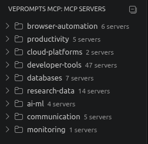
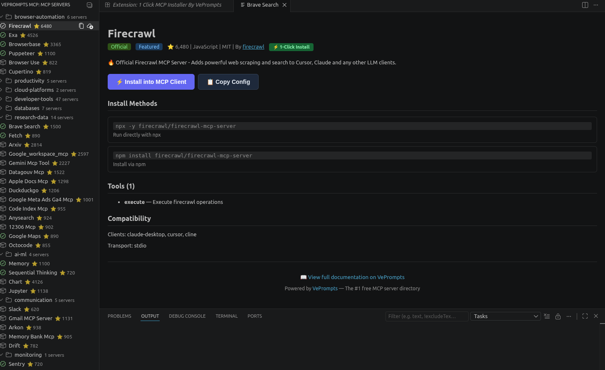
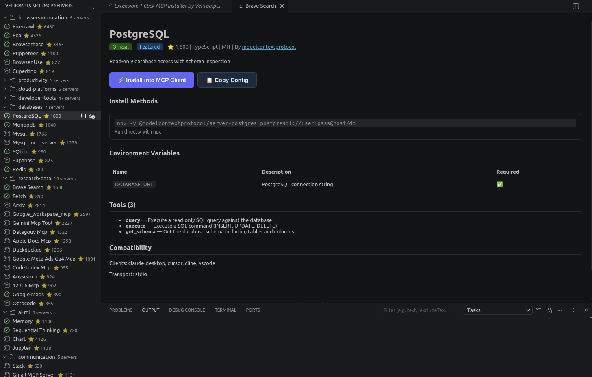

# 1 Click MCP Installer By VePrompts

Install MCP servers from [VePrompts](https://veprompts.com) with one click inside VS Code.

## Screenshots

**Activity Bar Icon**



The MCP Installer panel is accessible from the VS Code activity bar via the plug icon.

**Server Tree View**



Browse MCP servers by category. Installed servers show a checkmark. Click any server to install.

**Install Prompt**



Select your target MCP client and enter required environment variables. The server is added to your client's config automatically.

## Supported Clients

| Client | Platform | Config Path |
|--------|----------|-------------|
| Claude Desktop | macOS, Windows, Linux | `~/Library/Application Support/Claude/claude_desktop_config.json` |
| Cursor | Universal | `~/.cursor/mcp.json` |
| Cline | macOS, Windows, Linux | `~/Library/Application Support/Code/.../cline_mcp_settings.json` |
| Windsurf | Universal | `~/.codeium/windsurf/mcp_config.json` |
| VS Code (native MCP) | macOS, Windows, Linux | `~/Library/Application Support/Code/User/mcp.json` |
| Continue.dev | Universal | `~/.continue/config.json` |
| Zed | macOS, Linux | `~/.config/zed/settings.json` |
| mcphub.nvim | Universal | `~/.config/mcphub/servers.json` |

## Features

- **One-click install** — Browse 90+ MCP servers and install to any supported client
- **Auto-detect clients** — Automatically finds installed MCP clients on your system
- **Environment variable prompts** — Securely enter API keys during installation
- **Multi-client support** — Install the same server to multiple clients
- **Catalog sync** — Always up-to-date with the latest MCP servers from VePrompts

## Installation

1. Install from the VS Code Marketplace (coming soon)
2. Or install manually from the [Open VSX Registry](https://open-vsx.org) (coming soon)
3. Open the MCP Installer panel from the activity bar
4. Browse categories or search for servers
5. Click install on any server

## Usage

### Install a Server

1. Click on a server in the tree view
2. Select your MCP client (or let it auto-detect)
3. Enter any required API keys
4. The server is added to your client's config

### Search Servers

Use the command palette (`Cmd+Shift+P` / `Ctrl+Shift+P`) and type "VePrompts" to:
- Search MCP servers
- Install specific servers
- Copy install commands

### Configure Preferred Client

Set your default MCP client in VS Code settings:

```json
{
  "veprompts-mcp.preferredClient": "cursor"
}
```

Options: `auto`, `claude-desktop`, `cursor`, `cline`, `windsurf`, `vscode`, `continue`, `zed`, `mcphub-nvim`

## Links

- [VePrompts MCP Directory](https://veprompts.com/mcp/servers/) — Browse all 90+ servers
- [VePrompts](https://veprompts.com) — AI tools and prompts
- [Built by Veduis](https://veduis.com) — Digital agency specializing in AI tooling
- [Launch Announcement](https://veduis.com/blog/veprompts-2-0-mcp-server-directory-launch/) — Read about the VePrompts 2.0 launch on the Veduis blog

## License

MIT
